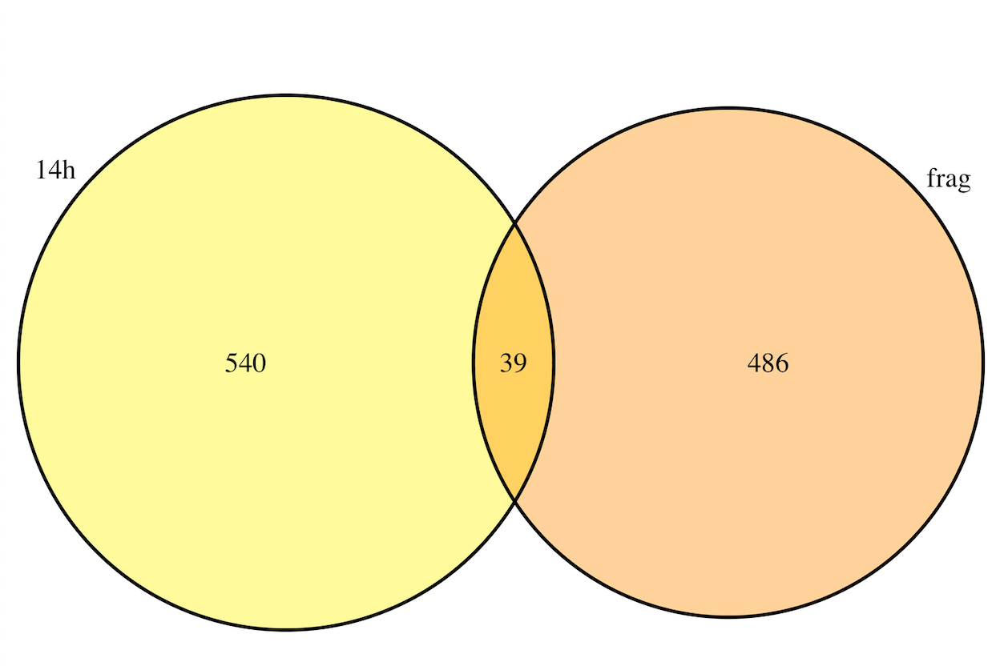

## Integration part 1

Previously, RNA-sequencing has been done on two mutant strains of *S. venezuelae*: $\Delta$*rnc* (encoding RNase III) and $\Delta$*rnj* (encoding RNase J). Some of the primary transcripts identified by dRNA-sequencing (*i.e.* TSS ID) may be direct targets of these ribonucleases and could be significantly differentially expressed in the mutant compared to the wild type. 

Rather than re-computing the RNA-seq analysis for the annotated genes in *S. venezuelae*, I am going to read in previously computed DESeq2 outputs and subset the data to see if there are any meaningful comparisons to be made. 

#### Read in the DESeq2 outputs for RNaseIII mutant

```{r}
#Read in DESeq2 outputs
#These files have been filtered by strain (mutant/WT) and developmental stage
rnc_vegetative <- read.csv("~/Desktop/Integration/rnc_rnaseq/rnc_wt_veg.csv",
                           header = T)

rnc_fragmentation <- read.csv("~/Desktop/Integration/rnc_rnaseq/rnc_WT_frag.csv", 
                              header = T)

rnc_sporulating <- read.csv("~/Desktop/Integration/rnc_rnaseq/rnc_WT_spore.csv", 
                            header = T)

#filter by adj p-value<0.05 and logFC>2 and baseMean>50 
library(dplyr)

rnc_vegetative <- filter(rnc_vegetative,
                                P.adj<0.05 & abs(log2.FC.)>2 & Base.Mean>50)
rnc_fragmentation <- filter(rnc_fragmentation,
                                P.adj<0.05 & abs(log2.FC.)>2 & Base.Mean>50)
rnc_sporulating <- filter(rnc_sporulating,
                                P.adj<0.05 & abs(log2.FC.)>2 & Base.Mean>50)

#filtering out NAs
rnc_vegetative <- na.omit(rnc_vegetative)
rnc_fragmentation <- na.omit(rnc_fragmentation)
rnc_sporulating <- na.omit(rnc_sporulating)

```
### RNase III vs antisense TSSs 

Now the first comparison I am interested in making is between the RNase III deferentially expressed genes and the genes which contain antisense TSSs internally or immediately downstream. These transcripts are candidates for sRNA binding (and resulting local double-strandedness) making them potential RNase III targets, given that RNase III is a dsRNA-specific enzyme. 

#### Combine all antisense TSSs into one vector
```{r}
#As an initial pass to see if there is any overlap between these datasets involves
#combining all of the antisense TSSs and all of the significantly differentially
#expressed genes in the RNase III RNA-sequencing data set 

#we need to read-in the TSS data
#read in downstream antisense TSS files
downstream_10h <- read.delim("~/Desktop/TSS_vnz/downstream_antisense/10h_downstream.bed",
                             sep = '\t', 
                             header = FALSE)
downstream_14h <- read.delim("~/Desktop/TSS_vnz/downstream_antisense/14h_downstream.bed",
                             sep = '\t', 
                             header = FALSE)
downstream_18h <- read.delim("~/Desktop/TSS_vnz/downstream_antisense/18h_downstream.bed",
                             sep = '\t', 
                             header = FALSE)
downstream_24h <- read.delim("~/Desktop/TSS_vnz/downstream_antisense/24h_downstream.bed",
                             sep = '\t', 
                             header = FALSE)
#Read in internal antisense TSS files
internal_antisense_10h <- read.delim("~/Desktop/TSS_vnz/internal/10h_antisense.bed", 
                                     sep = '\t', 
                                     header = FALSE)
internal_antisense_14h <- read.delim("~/Desktop/TSS_vnz/internal/14h_antisense.bed",
                                     sep = '\t', 
                                     header = FALSE)
internal_antisense_18h <- read.delim("~/Desktop/TSS_vnz/internal/18h_antisense.bed",
                                     sep = '\t', 
                                     header = FALSE)
internal_antisense_24h <- read.delim("~/Desktop/TSS_vnz/internal/24h_antisense.bed", 
                                     sep = '\t',
                                     header = FALSE)

#Combine antisense into one category - as done in (paper)
all_antisense_10h <- rbind(downstream_10h, internal_antisense_10h)
all_antisense_14h <- rbind(downstream_14h, internal_antisense_14h)
all_antisense_18h <- rbind(downstream_18h, internal_antisense_18h)
all_antisense_24h <- rbind(downstream_24h, internal_antisense_24h)

#bind all antisense together
all_antisense <- rbind(all_antisense_10h, 
                       all_antisense_14h, 
                       all_antisense_18h, 
                       all_antisense_24h)

all_rnc <- rbind(rnc_vegetative, 
                 rnc_sporulating, 
                 rnc_fragmentation)

```

### Making Venn Diagrams! 
```{r}
#I will then use these combined datasets in a Venn diagram 

library(VennDiagram)
venn.diagram(
        x = list(all_antisense$V15, all_rnc$gene.ID),
        category.names = c("TSS", "rnc"),
        filename = '~/Desktop/Integration/Images/all_TSS_rnc.png',
        fill= c("light blue", "pink"))
```
There seems to be some pretty significant overlap there!

```{r, out.width = "50%"}


#Comparison of all differentially expressed RNaseIII genes 
#and genes that contain antisense TSSs
```


Given that there seems to be some overlap between these two data sets, the next interesting comparison would be to look at each time point individually.

The RNA-seq data set is split into each developmental stage **(vegetative, fragmentation, and sporulation)**. The TSS data was collected for four different time-points (10h, 14h, 18h, and 24h). Generally, the 14h and 18h would both be within the "fragmentation" developmental stage (the liquid culture equivalent of raising aerial hyphae) - although the 14h culture could still have a lot of vegetative growth. 

So for the purpose of this analysis I'll repeat the "fragmentation" RNA-seq time point comparison with both the 14h and the 18h TSS data sets, and I will repeat the "vegetative" RNA-seq time point comparison for the 10h and 14h TSS data sets to capture all possible meaningful comparisons. 

#### 10hTSS vs vegetative RNA-seq
```{r TSS timepoint Venn diagrams}
#10h TSS vs vegetative
venn.diagram(
        x = list(all_antisense_10h$V15, rnc_vegetative$gene.ID),
        category.names = c("10h", "veg"),
        filename = '~/Desktop/Integration/Images/10h_TSS_rnc_veg.png',
        fill= c("red", "purple"))
```


```{r, out.width = "50%"}


#Comparison of all differentially expressed RNaseIII genes 
#and genes that contain antisense TSSs
```

#### 14hTSS vs vegetative RNA-seq
```{r}
#14h TSS vs vegetative
venn.diagram(
        x = list(all_antisense_14h$V15, rnc_vegetative$gene.ID),
        category.names = c("14h", "veg"),
        filename = '~/Desktop/Integration/Images/14h_TSS_rnc_veg.png',
        fill= c("yellow", "purple"))
```


```{r, out.width = "50%"}


#Comparison of all differentially expressed RNaseIII genes 
#and genes that contain antisense TSSs
```

#### 14hTSS vs fragmentation RNA-seq
```{r}
#14h TSS vs fragmentation
venn.diagram(
        x = list(all_antisense_14h$V15, rnc_fragmentation$gene.ID),
        category.names = c("14h", "frag"),
        filename = '~/Desktop/Integration/Images/14h_TSS_rnc_frag.png',
        fill= c("yellow", "orange"))
```


```{r, out.width = "50%"}


#Comparison of all differentially expressed RNaseIII genes 
#and genes that contain antisense TSSs
```

#### 18hTSS vs fragmentation RNA-seq
```{r}
#18h TSS vs fragmentation
venn.diagram(
        x = list(all_antisense_18h$V15, rnc_fragmentation$gene.ID),
        category.names = c("18h", "frag"),
        filename = '~/Desktop/Integration/Images/18h_TSS_rnc_frag.png',
        fill= c("pink", "orange"))
```


```{r, out.width = "50%"}


#Comparison of all differentially expressed RNaseIII genes 
#and genes that contain antisense TSSs
```

#### 24hTSS vs sporulation RNA-seq
```{r}
#24h TSS vs spore
venn.diagram(
        x = list(all_antisense_24h$V15, rnc_sporulating$gene.ID),
        category.names = c("24h", "spore"),
        filename = '~/Desktop/Integration/Images/24h_TSS_rnc_spore.png',
        fill= c("light blue", "light green"))
```


```{r, out.width = "50%"}


#Comparison of all differentially expressed RNaseIII genes 
#and genes that contain antisense TSSs
```

Based on this, there seems to be the most antisense TSSs which are within/downstream of genes that are differentially expressed in the RNase III mutant at later time-points (sporulation/24h, fragmentation/18h). 

very cool! 

It is going to be useful in the future to have tables with both the relevant TSS information and RNA-sequencing information. We will have to filter both tables by common variables (geneID) and then cbind. 

#### Merge data sets by rows with common geneID columns
```{r}
veg_10hTSS <- merge(rnc_vegetative, 
                    all_antisense_10h, 
                    by.x = "gene.ID", 
                    by.y = "V15")

veg_14hTSS <- merge(rnc_vegetative, 
                    all_antisense_14h, 
                    by.x = "gene.ID", 
                    by.y = "V15")

frag_14hTSS <- merge(rnc_fragmentation, 
                    all_antisense_14h, 
                    by.x = "gene.ID", 
                    by.y = "V15")

frag_18hTSS <- merge(rnc_fragmentation, 
                    all_antisense_18h, 
                    by.x = "gene.ID", 
                    by.y = "V15")

spore_24hTSS <- merge(rnc_sporulating, 
                    all_antisense_24h, 
                    by.x = "gene.ID", 
                    by.y = "V15")
```

#### Write csvs for these data sets 

```{r}
write.csv(veg_10hTSS, 
          file = "~/Desktop/Integration/rnc_antisenseTSS/veg_10hTSS.csv", 
          quote = FALSE, 
          row.names = FALSE)

write.csv(veg_14hTSS, 
          file = "~/Desktop/Integration/rnc_antisenseTSS/veg_14hTSS.csv", 
          quote = FALSE, 
          row.names = FALSE)

write.csv(frag_14hTSS, 
          file = "~/Desktop/Integration/rnc_antisenseTSS/frag_14hTSS.csv",
          quote = FALSE, 
          row.names = FALSE)

write.csv(frag_18hTSS, 
          file = "~/Desktop/Integration/rnc_antisenseTSS/frag_18hTSS.csv",
          quote = FALSE, 
          row.names = FALSE)

write.csv(spore_24hTSS, 
          file = "~/Desktop/Integration/rnc_antisenseTSS/spore_24hTSS.csv",
          quote = FALSE, 
          row.names = FALSE)
```

## Integration part 2! 

The next thing we are most interested in (biologically as something that is cool) is to follow up on the orphan TSSs which are differentially expressed in the RNase III and RNase J mutants compared to the WT. 

We are also interested in characterizing whether these TSSs correspond to the transcription of a true ncRNA. These TSSs could also drive the expressed of other transctipts, for example as primary TSSs with long 5' UTRs (all we know currently is that they are >250bp away from the nearest sense-gene and >40bp from the nearest antisense-gene). 

It will take several steps to answer this: 

1) Use the bedtools closest function to call the nearest downstream gene and the distance between the gene and TSS 

3) Filter the orphan TSSs whose closest downstream gene also exists in the "primary" TSS data-set. This would indicate that the gene in question has its own primary TSS, and thus the expression of the orphan TSS drives the expression of an independent transcript 

4) Those TSSs whose closest downstream gene does not have its own primary TSS are likely to initiate the expression of a long 5'UTR in addition to the gene itself. These can be filtered into their own table with the distance of the 5'UTR (between the TSS and the gene). For those that are up-regulated in the RNase III data-set, it may be worthwhile to see if any secondary structure is predicted for the inter-feature regions that could provide a dsRNA binding locus for RNase III. 


### find closest gene to all orphan TSSs

```{bash}
#first we have to sort the original orphan .bed files 
bedtools sort -i ~/Desktop/TSS_vnz/orphan_TSS/orphan_10h.bed > ~/Desktop/Integration/orphan_TSS_all/10h.bed

bedtools sort -i ~/Desktop/TSS_vnz/orphan_TSS/orphan_14h.bed > ~/Desktop/Integration/orphan_TSS_all/14h.bed

bedtools sort -i ~/Desktop/TSS_vnz/orphan_TSS/orphan_18h.bed > ~/Desktop/Integration/orphan_TSS_all/18h.bed

bedtools sort -i ~/Desktop/TSS_vnz/orphan_TSS/orphan_24h.bed > ~/Desktop/Integration/orphan_TSS_all/24h.bed

#then we will call the closest gene feature and their distance
bedtools closest -a ~/Desktop/Integration/orphan_TSS_all/10h.bed -b ~/Desktop/TSS_vnz/ref/vnz_genome.gff -s -iu -D a > ~/Desktop/Integration/orphan_closest/10h.bed

bedtools closest -a ~/Desktop/Integration/orphan_TSS_all/14h.bed -b ~/Desktop/TSS_vnz/ref/vnz_genome.gff -s -iu -D a > ~/Desktop/Integration/orphan_closest/14h.bed

bedtools closest -a ~/Desktop/Integration/orphan_TSS_all/18h.bed -b ~/Desktop/TSS_vnz/ref/vnz_genome.gff -s -iu -D a > ~/Desktop/Integration/orphan_closest/18h.bed

bedtools closest -a ~/Desktop/Integration/orphan_TSS_all/24h.bed -b ~/Desktop/TSS_vnz/ref/vnz_genome.gff -s -iu -D a > ~/Desktop/Integration/orphan_closest/24h.bed

```

### Read in the sorted .bed files with their closest genetic feature 

```{r}

orphan_10h <- read.table("~/Desktop/Integration/orphan_closest/10h.bed",
           header = FALSE, 
           sep = "\t")
orphan_14h <- read.table("~/Desktop/Integration/orphan_closest/14h.bed",
           header = FALSE, 
           sep = "\t")
orphan_18h <- read.table("~/Desktop/Integration/orphan_closest/18h.bed",
           header = FALSE,
           sep = "\t")
orphan_24h <- read.table("~/Desktop/Integration/orphan_closest/24h.bed",
           header = FALSE, 
           sep = "\t")

```

### Subset orphan TSSs as ncRNA or 5'UTR 

Now we can subset the orphan TSSs as either ncRNA or 5'UTR based on if their closest gene has its own primary TSS at that given time-point.

```{r}
#subset the ncRNA as orphan TSSs that are upstream of genes which have 
#their own primary TSS driving their expression 

#read in primary TSS again: 
primary_10h <- read.delim("~/Desktop/TSS_vnz/primary/10h_upstream.bed", 
                          sep = '\t', 
                          header = FALSE)
primary_14h <- read.delim("~/Desktop/TSS_vnz/primary/14h_upstream.bed", 
                          sep = '\t', 
                          header = FALSE)
primary_18h <- read.delim("~/Desktop/TSS_vnz/primary/18h_upstream.bed", 
                          sep = '\t', 
                          header = FALSE)
primary_24h <- read.delim("~/Desktop/TSS_vnz/primary/24h_upstream.bed", 
                          sep = '\t', 
                          header = FALSE)

#subset again by distance to closest gene
primary_10h <- primary_10h[primary_10h[,16] <= 250,]
primary_14h <- primary_14h[primary_14h[,16] <= 250,]
primary_18h <- primary_18h[primary_18h[,16] <= 250,]
primary_24h <- primary_24h[primary_24h[,16] <= 250,]

#subet the long 5' UTR as orphan TSSs that are upstream of genes which do not 
#have their own primary TSS, and thus might rely on the distant (>250bp) TSS as 
#their promoter 

ncRNA_10h <- orphan_10h[(orphan_10h$V15 %in% primary_10h$V15),]
UTR_10h <- orphan_10h[!(orphan_10h$V15 %in% primary_10h$V15),]

ncRNA_14h <- orphan_14h[(orphan_14h$V15 %in% primary_14h$V15),]
UTR_14h <- orphan_14h[!(orphan_14h$V15 %in% primary_14h$V15),]

ncRNA_18h <- orphan_18h[(orphan_18h$V15 %in% primary_18h$V15),]
UTR_18h <- orphan_18h[!(orphan_18h$V15 %in% primary_18h$V15),]

ncRNA_24h <- orphan_24h[(orphan_24h$V15 %in% primary_24h$V15),]
UTR_24h <- orphan_24h[!(orphan_24h$V15 %in% primary_24h$V15),]

```

### Read in DESeq2 outputs from orphanTSS RNA-seq

```{r}
#RNaseIII files 
rnc_veg_10h <- read.table("~/Desktop/RNA_seq/DESeq2/RNaseIII_veg_10hTSS.csv",
           header = TRUE, 
           sep = ",")
rnc_veg_14h <- read.table("~/Desktop/RNA_seq/DESeq2/RNaseIII_veg_14hTSS.csv",
           header = TRUE, 
           sep = ",")
rnc_frag_14h <- read.table("~/Desktop/RNA_seq/DESeq2/RNaseIII_frag_14hTSS.csv",
           header = TRUE, 
           sep = ",")
rnc_frag_18h <- read.table("~/Desktop/RNA_seq/DESeq2/RNaseIII_frag_18hTSS.csv",
           header = TRUE, 
           sep = ",")
rnc_spore_24h <- read.table("~/Desktop/RNA_seq/DESeq2/RNaseIII_spore_24hTSS.csv",
           header = TRUE, 
           sep = ",")

#RNaseJ files 
rnj_veg_10h <- read.table("~/Desktop/RNA_seq/DESeq2/RNaseJ_veg_10hTSS.csv",
           header = TRUE, 
           sep = ",")
rnj_veg_14h <- read.table("~/Desktop/RNA_seq/DESeq2/RNaseJ_veg_14hTSS.csv",
           header = TRUE, 
           sep = ",")
rnj_frag_14h <- read.table("~/Desktop/RNA_seq/DESeq2/RNaseJ_frag_14hTSS.csv",
           header = TRUE, 
           sep = ",")
rnj_frag_18h <- read.table("~/Desktop/RNA_seq/DESeq2/RNaseJ_frag_18hTSS.csv",
           header = TRUE, 
           sep = ",")
rnj_spore_24h <- read.table("~/Desktop/RNA_seq/DESeq2/RNaseJ_spore_24hTSS.csv",
           header = TRUE, 
           sep = ",")

```

### The final fun part: are the ncRNAs differentially expressed? 

```{r}
#Looking for similarities in the TSSs from the RNA-seq and ncRNA
#Making a merged dataset (to keep info from both)
rnc_veg_10h_nrRNA <- merge(rnc_veg_10h, ncRNA_10h, 
                    by.x = "X", by.y = "V4")
rnc_veg_14h_nrRNA <- merge(rnc_veg_14h, ncRNA_14h, 
                    by.x = "X", by.y = "V4")
rnc_frag_14h_nrRNA <- merge(rnc_frag_14h, ncRNA_14h, 
                    by.x = "X", by.y = "V4")
rnc_frag_18h_nrRNA <- merge(rnc_frag_18h, ncRNA_18h, 
                    by.x = "X", by.y = "V4")
rnc_spore_24h_nrRNA <- merge(rnc_spore_24h, ncRNA_24h, 
                    by.x = "X", by.y = "V4")


rnj_veg_10h_nrRNA <- merge(rnj_veg_10h, ncRNA_10h, 
                    by.x = "X", by.y = "V4")
rnj_veg_14h_nrRNA <- merge(rnj_veg_14h, ncRNA_14h, 
                    by.x = "X", by.y = "V4")
rnj_frag_14h_nrRNA <- merge(rnj_frag_14h, ncRNA_14h, 
                    by.x = "X", by.y = "V4")
rnj_frag_18h_nrRNA <- merge(rnj_frag_18h, ncRNA_18h, 
                    by.x = "X", by.y = "V4")
rnj_spore_24h_nrRNA <- merge(rnj_spore_24h, ncRNA_24h, 
                    by.x = "X", by.y = "V4")
```

Now it would probably make things easier to merge all of those time-points into one table, adding columns to indicate the time-point

This is not necessary for data sets with 0obs (veg_10h rnc/rnj)

```{r}
#adding descriptive column to each dataframe 
rnc_veg_14h_nrRNA['Timepoint']='veg_14h'
rnc_frag_14h_nrRNA['Timepoint']='frag_14h'
rnc_frag_18h_nrRNA['Timepoint']='frag_18h'
rnc_spore_24h_nrRNA['Timepoint']='spore_24h'

rnj_veg_14h_nrRNA['Timepoint']='veg_14h'
rnj_frag_14h_nrRNA['Timepoint']='frag_14h'
rnj_frag_18h_nrRNA['Timepoint']='frag_18h'
rnj_spore_24h_nrRNA['Timepoint']='spore_24h'

#combinging the dataframes 
rnc_diff_ncRNAs <- rbind(rnc_veg_14h_nrRNA,
                         rnc_frag_14h_nrRNA, 
                         rnc_frag_18h_nrRNA, 
                         rnc_spore_24h_nrRNA)

rnj_diff_ncRNAs <- rbind(rnj_veg_14h_nrRNA,
                         rnj_frag_14h_nrRNA, 
                         rnj_frag_18h_nrRNA, 
                         rnj_spore_24h_nrRNA)

#clean up the dataframes (only keeping important columns)
rnc_diff_ncRNAs <- cbind(rnc_diff_ncRNAs[1:3],
                         rnc_diff_ncRNAs$padj,
                         rnc_diff_ncRNAs[9:12],
                         rnc_diff_ncRNAs[21:23])

rnj_diff_ncRNAs <- cbind(rnj_diff_ncRNAs[1:3],
                         rnj_diff_ncRNAs$padj,
                         rnj_diff_ncRNAs[9:12],
                         rnj_diff_ncRNAs[21:23])

ColNames <- c("TSS_ID", "baseMean", "log2FC", "padj", "TSS_start", "TSS_end", "bedscore", "strand", "closest_gene", "distance", "timepoints")

rnc_diff_ncRNAs <- `colnames<-`(rnc_diff_ncRNAs, ColNames)
rnj_diff_ncRNAs <- `colnames<-`(rnj_diff_ncRNAs, ColNames)

#All done making them pretty! write csvs 

write.csv(rnc_diff_ncRNAs, 
          "~/Desktop/Integration/rnc_diff_ncRNAs.csv", 
          quote = FALSE, 
          row.names = FALSE)

write.csv(rnj_diff_ncRNAs, 
          "~/Desktop/Integration/rnj_diff_ncRNAs.csv", 
          quote = FALSE, 
          row.names = FALSE)

```

All done the ncRNAs! We've got some overlapping TSSs between the two data sets! 

Now the hypothetical 5'UTRs are maybe still not complete. Manually checking a few of them, it seems that many of them are actually antisense-downstream to their closest genes - but not within 40bp. So the "bedtools closest" function, forcing same-strandedness, called them upstream of certain genes - when in reality there are 1+ genes between the TSS and "closest-sense" gene. 

To fix this and look for genuine 5'UTR I'm going to call the bedtools closest function without forcing same strandedness and subset it by the current data-set. This would filter for TSSs that are >250bp of a gene, upstream of it, with no other genes in between. 

#### bedtools closest, again! 

```{bash}


#then we will call the closest gene feature and their distance
bedtools closest -a ~/Desktop/Integration/orphan_TSS_all/10h.bed -b ~/Desktop/TSS_vnz/ref/vnz_genome.gff -iu -D a > ~/Desktop/Integration/orphan_closest/10h_any_strand.bed

bedtools closest -a ~/Desktop/Integration/orphan_TSS_all/14h.bed -b ~/Desktop/TSS_vnz/ref/vnz_genome.gff -iu -D a > ~/Desktop/Integration/orphan_closest/14h_any_strand.bed

bedtools closest -a ~/Desktop/Integration/orphan_TSS_all/18h.bed -b ~/Desktop/TSS_vnz/ref/vnz_genome.gff -iu -D a > ~/Desktop/Integration/orphan_closest/18h_any_strand.bed

bedtools closest -a ~/Desktop/Integration/orphan_TSS_all/24h.bed -b ~/Desktop/TSS_vnz/ref/vnz_genome.gff -iu -D a > ~/Desktop/Integration/orphan_closest/24h_any_strand.bed

```

#### read-in any-strand closest genes 

```{r}

orphan_10h_any_strand <- read.table("~/Desktop/Integration/orphan_closest/10h_any_strand.bed",
           header = FALSE, 
           sep = "\t")
orphan_14h_any_strand <- read.table("~/Desktop/Integration/orphan_closest/14h_any_strand.bed",
           header = FALSE, 
           sep = "\t")
orphan_18h_any_strand <- read.table("~/Desktop/Integration/orphan_closest/18h_any_strand.bed",
           header = FALSE,
           sep = "\t")
orphan_24h_any_strand <- read.table("~/Desktop/Integration/orphan_closest/24h_any_strand.bed",
           header = FALSE, 
           sep = "\t")
```

#### subset 5'UTR by closest sense gene also being actual closest gene

```{r}
UTR_10h <- UTR_10h[(UTR_10h$V15 %in% orphan_10h_any_strand$V15),]
UTR_14h <- UTR_10h[(UTR_14h$V15 %in% orphan_14h_any_strand$V15),]
UTR_18h <- UTR_10h[(UTR_18h$V15 %in% orphan_18h_any_strand$V15),]
UTR_24h <- UTR_10h[(UTR_24h$V15 %in% orphan_24h_any_strand$V15),]
```
#### Add gene product column 

The Elliot lab has a csv with the vnz_ gene loci and their associated gene products. By merging these two data sets, we can easily annotate the gene products associated with these potential long 5'UTRs 

```{r}
#read in vnz_produts csv
vnz_products <- read.csv("~/Desktop/Integration/vnz_products.csv")
vnz_products <- vnz_products[1:2]

UTR_10h <- merge(UTR_10h, 
                 vnz_products, 
                 by.x = "V15",
                 by.y = "Locus.Tag")

UTR_14h <- merge(UTR_14h, 
                 vnz_products, 
                 by.x = "V15",
                 by.y = "Locus.Tag")

UTR_18h <- merge(UTR_18h, 
                 vnz_products, 
                 by.x = "V15",
                 by.y = "Locus.Tag")

UTR_24h <- merge(UTR_24h, 
                 vnz_products, 
                 by.x = "V15",
                 by.y = "Locus.Tag")

#Clean up the datasets, keeping the important columns 
UTR_10h <- cbind(UTR_10h[1],
                 UTR_10h[5],
                 UTR_10h[3:4],
                 UTR_10h[6:7],
                 UTR_10h[16:17])

UTR_14h <- cbind(UTR_14h[1],
                 UTR_14h[5],
                 UTR_14h[3:4],
                 UTR_14h[6:7],
                 UTR_14h[16:17])

UTR_18h <- cbind(UTR_18h[1],
                 UTR_18h[5],
                 UTR_18h[3:4],
                 UTR_18h[6:7],
                 UTR_18h[16:17])

UTR_24h <- cbind(UTR_24h[1],
                 UTR_24h[5],
                 UTR_24h[3:4],
                 UTR_24h[6:7],
                 UTR_24h[16:17])

UTR_colnames <- c("vnz_ID", "TSS_ID", "TSS_start", "TSS_end", "bedscore", "strand", "gene_distance", "gene_product")

UTR_10h <- `colnames<-`(UTR_10h, UTR_colnames)
UTR_14h <- `colnames<-`(UTR_14h, UTR_colnames)
UTR_18h <- `colnames<-`(UTR_18h, UTR_colnames)
UTR_24h <- `colnames<-`(UTR_24h, UTR_colnames)
```

### Now to write the final csvs for this analysis!!! 

```{r}
write.csv(UTR_10h, 
          "~/Desktop/Integration/UTR_10h.csv", 
          row.names = FALSE)

write.csv(UTR_14h, 
          "~/Desktop/Integration/UTR_14h.csv", 
          row.names = FALSE)

write.csv(UTR_18h, 
          "~/Desktop/Integration/UTR_18h.csv", 
          row.names = FALSE)

write.csv(UTR_24h, 
          "~/Desktop/Integration/UTR_24h.csv", 
          row.names = FALSE)
```

That's it! I'm sure there's lots more data to be mined from these data sets, but for the purposes of this project I think we have found a lot of neat things! 


