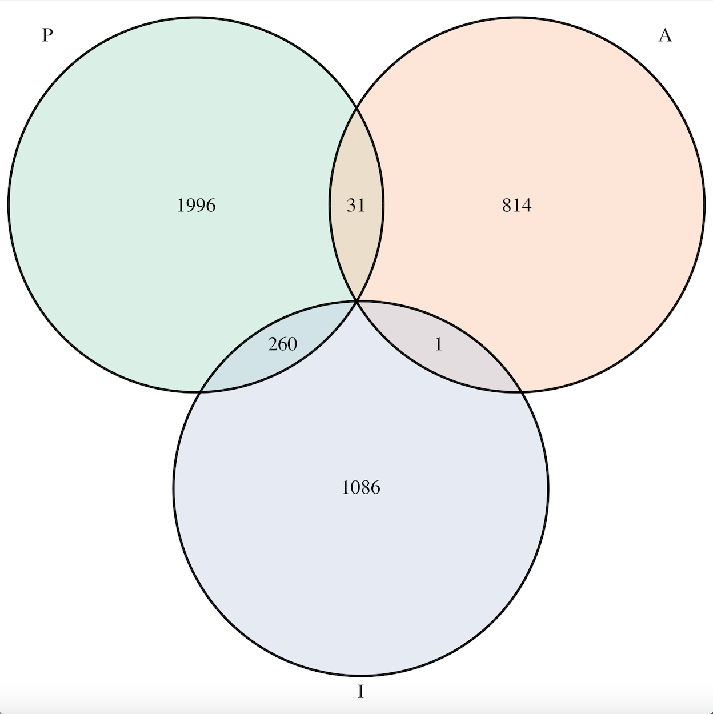

Time to get started! There are three main sections in this analysis: 
 1) TSS identification 
 2) RNA-seq analysis 
 3) integration of RNA-seq and TSS data

First up!

---
TSS Identification
---

Differential RNA sequencing (dRNA-seq) is a technique designed to examine the architecture of bacterial operons and the precise position of transcription start sites (TSS). 

The following analysis is designed to **i) identify, ii) annotate, and iii) analyze TSSs** in the model organism *Streptomyces venezuelae*. In addition to this, steps following identification of TSSs will aim to integrate these data with RNA-sequencing analyses of *S. venezuelae* mutant strains, where the genes encoding two different ribonucelases (RNases) are deleted. 

The first step of the analysis is to **quality check** the illumina-sequenced dRNA-seq reads:

### FastQC
```{r eval=FALSE}
#using the fastqr program to quality check the sequences 
#the following are packages that need to be installed. For the sake of being able to properly
#knit the markdown the functions are commented out - simply remove the comment and run the
#functions. 

#install.packages("fastqcr")
library(fastqcr)
fastqc_install(dest.dir = "~/Desktop/TSS_vnz/")

#run the fastQC tool on all .fastq files 
#(it will automatically run on every .fastq file in the directory you call)

fastqc(fq.dir = "~/Desktop/TSS_vnz/raw/", 
       qc.dir = "~/Desktop/TSS/FastQC/", 
       fastqc.path = "~/Desktop/TSS/FastQC/fastqc")

```

You can go into the output folder on your local computer and read through the html FastQC outputs. Or, you can look here: 

[10h_control](file:///Users/meghanpepler/Desktop/TSS_vnz/FastQC_output/10h_control_fastqc.html)

[10h_TSS](file:///Users/meghanpepler/Desktop/TSS_vnz/FastQC_output/10h_TSS_fastqc.html)

[14h_control](file:///Users/meghanpepler/Desktop/TSS_vnz/FastQC_output/14h_control_fastqc.html)

[14h_TSS](file:///Users/meghanpepler/Desktop/TSS_vnz/FastQC_output/14h_TSS_fastqc.html)

[18h_control](file:///Users/meghanpepler/Desktop/TSS_vnz/FastQC_output/18h_control_fastqc.html)

[18h_TSS](file:///Users/meghanpepler/Desktop/TSS_vnz/FastQC_output/18h_TSS_fastqc.html)

[24h_control](file:///Users/meghanpepler/Desktop/TSS_vnz/FastQC_output/24h_control_fastqc.html)

[24h_TSS](file:///Users/meghanpepler/Desktop/TSS_vnz/FastQC_output/24h_TSS_fastqc.html)

In this specific example you'll note that there are many sequences which are flagged as "over-represented". Given the nature of dRNA-sequencing this is expected, as the reads are generated to align precise transcription start sites and therefore overlap with each other exactly. 

The next step is to **align the fastq files to the reference genome using Rbowtie2:** 

### RBowtie2

```{r eval=FALSE}
library(Rbowtie2)
library(Rsamtools)

bowtie2_build(references="ref/vnz_genome.fasta", bt2Index = "ref/venezuelae_bowtie", overwrite = TRUE)

bowtie2(bt2Index = "ref/venezuelae_bowtie", 
        samOutput = "sam_out/10h_control", 
        seq1 = "raw/10h_control.fastq", 
        seq2 = NULL)
bowtie2(bt2Index = "ref/venezuelae_bowtie", 
        samOutput = "sam_out/10h_TSS",
        seq1 = "raw/10h_TSS.fastq", 
        seq2 = NULL)

bowtie2(bt2Index = "ref/venezuelae_bowtie", 
        samOutput = "sam_out/14h_control", 
        seq1 = "raw/14h_control.fastq", 
        seq2 = NULL)
bowtie2(bt2Index = "ref/venezuelae_bowtie", 
        samOutput = "sam_out/14h_TSS", 
        seq1 = "raw/14h_TSS.fastq", 
        seq2 = NULL)

bowtie2(bt2Index = "ref/venezuelae_bowtie", 
        samOutput = "sam_out/18h_control", 
        seq1 = "raw/18h_control.fastq", 
        seq2 = NULL)
bowtie2(bt2Index = "ref/venezuelae_bowtie", 
        samOutput = "sam_out/18h_TSS", 
        seq1 = "raw/18h_TSS.fastq", 
        seq2 = NULL)

bowtie2(bt2Index = "ref/venezuelae_bowtie", 
        samOutput = "sam_out/24h_control", 
        seq1 = "raw/24h_control.fastq", 
        seq2 = NULL)
bowtie2(bt2Index = "ref/venezuelae_bowtie", 
        samOutput = "sam_out/24h_TSS", 
        seq1 = "raw/24h_TSS.fastq", 
        seq2 = NULL)
```

The bowtie2 function outputs .sam files which need to be converted to .bam files for further analysis: 

### File conversion and pre-processing 
```{r eval=FALSE}
asBam(file = "sam_out/10h_control", destination = "bam_out/10h_control")
asBam(file = "sam_out/14h_control", destination = "bam_out/14h_control")
asBam(file = "sam_out/18h_control", destination = "bam_out/18h_control")
asBam(file = "sam_out/24h_control", destination = "bam_out/24h_control")

asBam(file = "sam_out/10h_TSS", destination = "bam_out/10h_TSS")
asBam(file = "sam_out/14h_TSS", destination = "bam_out/14h_TSS")
asBam(file = "sam_out/18h_TSS", destination = "bam_out/18h_TSS")
asBam(file = "sam_out/24h_TSS", destination = "bam_out/24h_TSS")

```

The .bam files need to then be sorted, indexed, and filtered

```{r eval=FALSE}
#sort (by leftmost coordinates)

sortBam(file = "bam_out/10h_control.bam", destination = "sort_bam/10h_control")
sortBam(file = "bam_out/14h_control.bam", destination = "sort_bam/14h_control")
sortBam(file = "bam_out/18h_control.bam", destination = "sort_bam/18h_control")
sortBam(file = "bam_out/24h_control.bam", destination = "sort_bam/24h_control")

sortBam(file = "bam_out/10h_TSS.bam", destination = "sort_bam/10h_TSS")
sortBam(file = "bam_out/14h_TSS.bam", destination = "sort_bam/14h_TSS")
sortBam(file = "bam_out/18h_TSS.bam", destination = "sort_bam/18h_TSS")
sortBam(file = "bam_out/24h_TSS.bam", destination = "sort_bam/24h_TSS")

#index

indexBam("bam_out/10h_control.bam", "sort_bam/10h_control")
indexBam("bam_out/14h_control.bam", "sort_bam/14h_control")
indexBam("bam_out/18h_control.bam", "sort_bam/18h_control")
indexBam("bam_out/24h_control.bam", "sort_bam/24h_control")

indexBam("bam_out/10h_TSS.bam", "sort_bam/10h_TSS")
indexBam("bam_out/14h_TSS.bam", "sort_bam/14h_TSS")
indexBam("bam_out/18h_TSS.bam", "sort_bam/18h_TSS")
indexBam("bam_out/24h_TSS.bam", "sort_bam/24h_TSS")

#filter out unmapped sequences 

filterBam(file = "sort_bam/10h_control.bam", 
          index = "bam_out/10h_control.bam.bai", 
          destination = "filter_bam/10h_control_subset.bam", 
          param = ScanBamParam(flag=scanBamFlag(isUnmappedQuery=FALSE),
                               what="seq"))
filterBam(file = "sort_bam/14h_control.bam", 
          index = "bam_out/14h_control.bam.bai", 
          destination = "filter_bam/14h_control.bam",
          param = ScanBamParam(flag=scanBamFlag(isUnmappedQuery=FALSE),
                               what="seq"))
filterBam(file = "sort_bam/18h_control.bam", 
          index = "bam_out/18h_control.bam.bai", 
          destination = "filter_bam/18h_control.bam",
          param = ScanBamParam(flag=scanBamFlag(isUnmappedQuery=FALSE),
                               what="seq"))
filterBam(file = "sort_bam/24h_control.bam", 
          index = "bam_out/24h_control.bam.bai", 
          destination = "filter_bam/24h_control.bam",
          param = ScanBamParam(flag=scanBamFlag(isUnmappedQuery=FALSE),
                               what="seq"))

filterBam(file = "sort_bam/10h_TSS.bam", 
          index = "bam_out/10h_TSS.bam.bai", 
          destination = "filter_bam/10h_TSS.bam",
          param = ScanBamParam(flag=scanBamFlag(isUnmappedQuery=FALSE),
                               what="seq"))
filterBam(file = "sort_bam/14h_TSS.bam", 
          index = "bam_out/14h_TSS.bam.bai", 
          destination = "filter_bam/14h_TSS.bam",
          param = ScanBamParam(flag=scanBamFlag(isUnmappedQuery=FALSE),
                               what="seq"))
filterBam(file = "sort_bam/18h_TSS.bam", 
          index = "bam_out/18h_TSS.bam.bai", 
          destination = "filter_bam/18h_TSS.bam",
          param = ScanBamParam(flag=scanBamFlag(isUnmappedQuery=FALSE),
                               what="seq"))
filterBam(file = "sort_bam/24h_TSS.bam", 
          index = "bam_out/24h_TSS.bam.bai", 
          destination = "filter_bam/24h_TSS.bam",
          param = ScanBamParam(flag=scanBamFlag(isUnmappedQuery=FALSE),
                               what="seq"))
```
### TSSAR

The program we are going to use to identify TSS in *S. venezuelae* is called **TSSAR (TSS annotation regime)**

It required .sam input files and for the alignment file to only contain one chromosome. In *S. venezuelae* there is a plasmid in our typical .gff and .fasta files so we will have to filter out those sequences to proceed with the TSS identification. 

To filter out the plasmid annotations/sequence we will use **samtools**. The programming for this is better suited to bash (accessing it from your terminal or a remote server). I've installed it on my local computer. 

#### More pre-processing for TSSAR

```{bash, eval=FALSE}
#filtering out plasmid-aligned files (only keeping chromosome CP018074.1)

#conda install -c bioconda samtools (uncomment if you need to install this program)

samtools view -h -b ~/Desktop/TSS/bam_out/10h_TSS.bam CP018074.1 -o ~/Desktop/TSS/bam_chr1/10h_TSS_chr1.bam
samtools view -h -b ~/Desktop/TSS/bam_out/14h_TSS.bam CP018074.1 -o ~/Desktop/TSS/bam_chr1/14h_TSS_chr1.bam
samtools view -h -b ~/Desktop/TSS/bam_out/18h_TSS.bam CP018074.1 -o ~/Desktop/TSS/bam_chr1/18h_TSS_chr1.bam
samtools view -h -b ~/Desktop/TSS/bam_out/24h_TSS.bam CP018074.1 -o ~/Desktop/TSS/bam_chr1/24h_TSS_chr1.bam

samtools view -h -b ~/Desktop/TSS/bam_out/10h_control.bam CP018074.1 -o ~/Desktop/TSS/bam_chr1/10h_control_chr1.bam
samtools view -h -b ~/Desktop/TSS/bam_out/14h_control.bam CP018074.1 -o ~/Desktop/TSS/bam_chr1/14h_control_chr1.bam
samtools view -h -b ~/Desktop/TSS/bam_out/18h_control.bam CP018074.1 -o ~/Desktop/TSS/bam_chr1/18h_control_chr1.bam
samtools view -h -b ~/Desktop/TSS/bam_out/24h_control.bam CP018074.1 -o ~/Desktop/TSS/bam_chr1/24h_control_chr1.bam

#coverting back into .sam 

samtools view -h ~/Desktop/TSS/bam_chr1/10h_TSS_chr1.bam > ~/Desktop/TSS/sam_chr1/10h_TSS_chr1.sam
samtools view -h ~/Desktop/TSS/bam_chr1/14h_TSS_chr1.bam > ~/Desktop/TSS/sam_chr1/14h_TSS_chr1.sam
samtools view -h ~/Desktop/TSS/bam_chr1/18h_TSS_chr1.bam > ~/Desktop/TSS/sam_chr1/18h_TSS_chr1.sam
samtools view -h ~/Desktop/TSS/bam_chr1/24h_TSS_chr1.bam > ~/Desktop/TSS/sam_chr1/24h_TSS_chr1.sam


samtools view -h ~/Desktop/TSS/bam_chr1/10h_control_chr1.bam > ~/Desktop/TSS/sam_chr1/10h_control_chr1.sam
samtools view -h ~/Desktop/TSS/bam_chr1/14h_control_chr1.bam > ~/Desktop/TSS/sam_chr1/14h_control_chr1.sam
samtools view -h ~/Desktop/TSS/bam_chr1/18h_control_chr1.bam > ~/Desktop/TSS/sam_chr1/18h_control_chr1.sam
samtools view -h ~/Desktop/TSS/bam_chr1/24h_control_chr1.bam > ~/Desktop/TSS/sam_chr1/24h_control_chr1.sam

```
TSSAR is a Perl and R-based program. The program can be downloaded from [here](http://nibiru.tbi.univie.ac.at/TSSAR/download) and stored either on your local computer or a remote server. The program takes input **.sam files**, writes coverage files, generates an R-script for the statistical analysis and prediction of TSS, runs the R. script, and writes .bed files where each predicted TSS is listed.

The layout of this function is quite simple. You must call the downloaded TSSAR program (which is within the downloaded TSSAR_1.0.1 folder). You then call the library which is enriched for triphosphate 5' ends (library plus; --libP), call the library which is NOT enriched for triphosphate 5' ends (library minus; --libM), and then a .fasta file for the genome to which these reads are aligned so that TSSAR can compute the effective genome size. 

Note that these functions (particularly the R.script) takes a verrrrryy long to run. For the analysis I used infoserv (thank you Brian!)

#### TSSAR syntax

```{bash, eval=FALSE}

#library 18h 
TSSAR_1.0.1/TSSAR --libP ~/TSSAR/TSSAR_input/sam_chr1/10h_TSS_chr1.sam 
    --libM ~/TSSAR/TSSAR_input/sam_chr1/10h_control_chr1.sam 
    --fasta ~/TSSAR/TSSAR_input/ref/vnz_genome.fasta > 10h_TSS.bed

TSSAR_1.0.1/TSSAR --libP ~/TSSAR/TSSAR_input/sam_chr1/14h_TSS_chr1.sam 
    --libM ~/TSSAR/TSSAR_input/sam_chr1/14h_control_chr1.sam 
    --fasta ~/TSSAR/TSSAR_input/ref/vnz_genome.fasta > 14h_TSS.bed

TSSAR_1.0.1/TSSAR --libP ~/TSSAR/TSSAR_input/sam_chr1/18h_TSS_chr1.sam 
    --libM ~/TSSAR/TSSAR_input/sam_chr1/18h_control_chr1.sam 
    --fasta ~/TSSAR/TSSAR_input/ref/vnz_genome.fasta > 18h_TSS.bed

TSSAR_1.0.1/TSSAR --libP ~/TSSAR/TSSAR_input/sam_chr1/24h_TSS_chr1.sam 
    --libM ~/TSSAR/TSSAR_input/sam_chr1/24h_control_chr1.sam 
    --fasta ~/TSSAR/TSSAR_input/ref/vnz_genome.fasta > 24h_TSS.bed

```
I found that when running this program, the function stores the entire output into a file. Before any analysis I opened the .bed files in a simple text editor to comment out the descriptive output (number of TSSAR outputs,etc.). 


### Filtering TSSAR output 

We now want to subset the data to make the most meaningful comparisons. TSSAR outputs a **bedscore** associated with each TSS. As far as I can tell this is a non-linear arbitrary score (the values range from 1-278308 for 10h sample). There are many more TSSs with scores between 1-100 than those with scores >100. By manually inspecting the TSSs with some representative scores (1, 10, 50, 100, 1000, 10000) it seems that the higher the score the more "significant" the TSS is (*i.e.* the bigger the difference is between the enriched/+ library and the control/- library). Generally, it seems that the extremely low scores are not biologically significant, even though the program called them as statistically significant.

By the end of the analysis I'll inspect the short-list of interesting TSS candidates manually to see how strong the enrichment is and what the counts are of reads that are aligning in the +library. As a preliminary filter it would be worthwhile to get rid of some poor quality TSSs. By manually inspecting the .bam files in IGV it seems that anything with a bed score under 30 isn't terribly significant. So I will do a preliminary filtering of the TSSs by bedscore:

```{bash filter by bedscore}
awk -F"\t" '$5>30' ~/Desktop/TSS_vnz/TSS_output/10h_TSS.txt > ~/Desktop/TSS_vnz/TSS_output/TSS_10h_new.bed
  
awk -F"\t" '$5>30' ~/Desktop/TSS_vnz/TSS_output/14h_TSS.txt > ~/Desktop/TSS_vnz/TSS_output/TSS_14h_new.bed
  
awk -F"\t" '$5>30' ~/Desktop/TSS_vnz/TSS_output/18h_TSS.txt > ~/Desktop/TSS_vnz/TSS_output/TSS_18h_new.bed
  
awk -F"\t" '$5>30' ~/Desktop/TSS_vnz/TSS_output/24h_TSS.txt > ~/Desktop/TSS_vnz/TSS_output/TSS_24h_new.bed

```
#### Sort bed files by chromosomal position 

Now we can start cleaning up the .bed files. The output stores them by strand order first (all + strand TSSs and then all - strand TSSs). I want to sort them instead by chromosomal position: 

```{bash bedtools sort}
bedtools sort -i ~/Desktop/TSS_vnz/TSS_output/TSS_10h_new.bed > ~/Desktop/TSS_vnz/TSS_sorted_bed/10h.bed

bedtools sort -i ~/Desktop/TSS_vnz/TSS_output/TSS_14h_new.bed > ~/Desktop/TSS_vnz/TSS_sorted_bed/14h.bed

bedtools sort -i ~/Desktop/TSS_vnz/TSS_output/TSS_18h_new.bed > ~/Desktop/TSS_vnz/TSS_sorted_bed/18h.bed

bedtools sort -i ~/Desktop/TSS_vnz/TSS_output/TSS_24h_new.bed > ~/Desktop/TSS_vnz/TSS_sorted_bed/24h.bed
```

This sorting also gets rid of the commented description: 


### Annotate TSSs based on their genomic context
We will be using several different **bedtools** functions to annotate all of the TSSs based on adjacent genes. 

#### Internal TSSs
There are a few things we are interested. The easiest first thing to do is to find TSS that overlap directly with known genes (i.e. are internal to gene regions). These can be sense and anti-sense to the direction of the gene. To differentiate these I chose to use bedtools on my local computer (intersect function): 

```{bash bedtools intersect}
#the lowercase -s flag forces same-strandedness (looking for same directional internal
#promoters). The -wo flag asks it to write the original A and B entries (I want a table 
#that contains both the TSS output and the corresponding gene info from the .gff file )

bedtools intersect -a ~/Desktop/TSS_vnz/TSS_sorted_bed/10h.bed -b ~/Desktop/TSS_vnz/ref/vnz_genome.gff -s -wo > ~/Desktop/TSS_vnz/internal/10h_internal.bed
bedtools intersect -a ~/Desktop/TSS_vnz/TSS_sorted_bed/14h.bed -b ~/Desktop/TSS_vnz/ref/vnz_genome.gff -s -wo> ~/Desktop/TSS_vnz/internal/14h_internal.bed
bedtools intersect -a ~/Desktop/TSS_vnz/TSS_sorted_bed/18h.bed -b ~/Desktop/TSS_vnz/ref/vnz_genome.gff -s -wo> ~/Desktop/TSS_vnz/internal/18h_internal.bed
bedtools intersect -a ~/Desktop/TSS_vnz/TSS_sorted_bed/24h.bed -b ~/Desktop/TSS_vnz/ref/vnz_genome.gff -s -wo> ~/Desktop/TSS_vnz/internal/24h_internal.bed

#the upercase -s flag forces opposite-strandedness (looking for anti-sense directional
#internal promoters). The -wo flag asks it to write the original A and B entries 
#(I want a table that contains both the TSS output and the corresponding gene info from the
#.gff file )
bedtools intersect -a ~/Desktop/TSS_vnz/TSS_sorted_bed/10h.bed -b ~/Desktop/TSS_vnz/ref/vnz_genome.gff -S -wo > ~/Desktop/TSS_vnz/internal/10h_antisense.bed

bedtools intersect -a ~/Desktop/TSS_vnz/TSS_sorted_bed/14h.bed -b ~/Desktop/TSS_vnz/ref/vnz_genome.gff -S -wo > ~/Desktop/TSS_vnz/internal/14h_antisense.bed

bedtools intersect -a ~/Desktop/TSS_vnz/TSS_sorted_bed/18h.bed -b ~/Desktop/TSS_vnz/ref/vnz_genome.gff -S -wo > ~/Desktop/TSS_vnz/internal/18h_antisense.bed

bedtools intersect -a ~/Desktop/TSS_vnz/TSS_sorted_bed/24h.bed -b ~/Desktop/TSS_vnz/ref/vnz_genome.gff -S -wo > ~/Desktop/TSS_vnz/internal/24h_antisense.bed

```
#### Primary TSSs

We also want to identify primary TSS - that is, promoters upstream (directionally) of a gene. I will get bedtools to report the distance each TSS is from the closest gene (-D a), forcing same-strandedndess (-s), only calling downstream features (ignoring upstream -iu), and only calling non-overlapping features (-io). Later, I will subset the output so that the "distance" is </= 250bp.

```{bash bedtools closest primary}
#the -s forces same strandedness
#The -iu ignores genes which are upstream of each TSS 
#(we only want genes which are downstream of TSS; i.e. TSS is upstream of given gene)
#-io ignores genes with which the TSS is directly overlapping
#-D a calls distance the gene is from TSS with respect to a (TSS) 

bedtools closest -a ~/Desktop/TSS_vnz/TSS_sorted_bed/10h.bed -b ~/Desktop/TSS_vnz/ref/vnz_genome.gff -s -io -iu -D a > ~/Desktop/TSS_vnz/primary/10h_upstream.bed

bedtools closest -a ~/Desktop/TSS_vnz/TSS_sorted_bed/14h.bed -b ~/Desktop/TSS_vnz/ref/vnz_genome.gff -s -io -iu -D a > ~/Desktop/TSS_vnz/primary/14h_upstream.bed

bedtools closest -a ~/Desktop/TSS_vnz/TSS_sorted_bed/18h.bed -b ~/Desktop/TSS_vnz/ref/vnz_genome.gff -s -io -iu -D a > ~/Desktop/TSS_vnz/primary/18h_upstream.bed

bedtools closest -a ~/Desktop/TSS_vnz/TSS_sorted_bed/24h.bed -b ~/Desktop/TSS_vnz/ref/vnz_genome.gff -s -io -iu -D a > ~/Desktop/TSS_vnz/primary/24h_upstream.bed
```
#### Antisense downstream TSSs

Similarly, we are interested in identifying TSS which are antisense to a given gene, just downstream of it. I will again report the distance to the closest gene, forcing opposite-strandedness. Later, I will subset this so that the "distance" is </= 40 bp.

```{bash bedtools closest antisense}
bedtools closest -a ~/Desktop/TSS_vnz/TSS_sorted_bed/10h.bed -b ~/Desktop/TSS_vnz/ref/vnz_genome.gff -S -io -iu -D a > ~/Desktop/TSS_vnz/downstream_antisense/10h_downstream.bed

bedtools closest -a ~/Desktop/TSS_vnz/TSS_sorted_bed/14h.bed -b ~/Desktop/TSS_vnz/ref/vnz_genome.gff -S -io -iu -D a > ~/Desktop/TSS_vnz/downstream_antisense/14h_downstream.bed

bedtools closest -a ~/Desktop/TSS_vnz/TSS_sorted_bed/18h.bed -b ~/Desktop/TSS_vnz/ref/vnz_genome.gff -S -io -iu -D a > ~/Desktop/TSS_vnz/downstream_antisense/18h_downstream.bed

bedtools closest -a ~/Desktop/TSS_vnz/TSS_sorted_bed/24h.bed -b ~/Desktop/TSS_vnz/ref/vnz_genome.gff -S -io -iu -D a > ~/Desktop/TSS_vnz/downstream_antisense/24h_downstream.bed
```

Orphan TSS will be called by filtering all of the TSS for ones that do not fall into any of the above lists. 

Now we can read these files into R and start cleaning them up! 

### Processing TSSAR output in R

#### Read output into R-studio
```{r read-in files}
#Read in internal antisense TSS files
internal_antisense_10h <- read.delim("~/Desktop/TSS_vnz/internal/10h_antisense.bed", sep = '\t', header = FALSE)
internal_antisense_14h <- read.delim("~/Desktop/TSS_vnz/internal/14h_antisense.bed", sep = '\t', header = FALSE)
internal_antisense_18h <- read.delim("~/Desktop/TSS_vnz/internal/18h_antisense.bed", sep = '\t', header = FALSE)
internal_antisense_24h <- read.delim("~/Desktop/TSS_vnz/internal/24h_antisense.bed", sep = '\t', header = FALSE)

#read in internal-sense TSS files 
internal_10h <- read.delim("~/Desktop/TSS_vnz/internal/10h_internal.bed", sep = '\t', header = FALSE)
internal_14h <- read.delim("~/Desktop/TSS_vnz/internal/14h_internal.bed", sep = '\t', header = FALSE)
internal_18h <- read.delim("~/Desktop/TSS_vnz/internal/18h_internal.bed", sep = '\t', header = FALSE)
internal_24h <- read.delim("~/Desktop/TSS_vnz/internal/24h_internal.bed", sep = '\t', header = FALSE)

#read in primary TSS files 
primary_10h <- read.delim("~/Desktop/TSS_vnz/primary/10h_upstream.bed", sep = '\t', header = FALSE)
primary_14h <- read.delim("~/Desktop/TSS_vnz/primary/14h_upstream.bed", sep = '\t', header = FALSE)
primary_18h <- read.delim("~/Desktop/TSS_vnz/primary/18h_upstream.bed", sep = '\t', header = FALSE)
primary_24h <- read.delim("~/Desktop/TSS_vnz/primary/24h_upstream.bed", sep = '\t', header = FALSE)

#read in downstream antisense TSS files
downstream_10h <- read.delim("~/Desktop/TSS_vnz/downstream_antisense/10h_downstream.bed", sep = '\t', header = FALSE)
downstream_14h <- read.delim("~/Desktop/TSS_vnz/downstream_antisense/14h_downstream.bed", sep = '\t', header = FALSE)
downstream_18h <- read.delim("~/Desktop/TSS_vnz/downstream_antisense/18h_downstream.bed", sep = '\t', header = FALSE)
downstream_24h <- read.delim("~/Desktop/TSS_vnz/downstream_antisense/24h_downstream.bed", sep = '\t', header = FALSE)

```

#### Subset Primary/Antisense downstream TSSs
Now we want to clean these files up before making any meaningful comparisons. We will start by subsetting the "primary" TSS to be within 250bp of their given genes. 

```{r subset primary TSS}
#column 16 is the distance from the TSS to its closest gene, forcing same strandedness 
#and ignoring "upstream" of TSS position; i.e. the gene must be downstream of the TSS 

primary_10h <- primary_10h[primary_10h[,16] <= 250,]
primary_14h <- primary_14h[primary_14h[,16] <= 250,]
primary_18h <- primary_18h[primary_18h[,16] <= 250,]
primary_24h <- primary_24h[primary_24h[,16] <= 250,]

```

Now we also want to subset the downstream to be within 40bp of their closest gene (which reads in the opposite direction of the TSS, but is downstream of it)

```{r subset antisense TSS}
downstream_10h <- downstream_10h[downstream_10h[,16] <= 40,]
downstream_14h <- downstream_14h[downstream_14h[,16] <= 40,]
downstream_18h <- downstream_18h[downstream_18h[,16] <= 40,]
downstream_24h <- downstream_24h[downstream_24h[,16] <= 40,]

```
#### Annotate orphan TSSs
Now, lets subset all of the time-points for "orphan" TSS; i.e. TSS that did not fall into any of the above categories 

```{r orhpan TSS}
#read in the raw output .bed file of each TSSAR run
all_TSS_10h <- read.delim("~/Desktop/TSS_vnz/TSS_output/TSS_10h_new.bed", sep = '\t', header = FALSE)
all_TSS_14h <- read.delim("~/Desktop/TSS_vnz/TSS_output/TSS_14h_new.bed", sep = '\t', header = FALSE)
all_TSS_18h <- read.delim("~/Desktop/TSS_vnz/TSS_output/TSS_18h_new.bed", sep = '\t', header = FALSE)
all_TSS_24h <- read.delim("~/Desktop/TSS_vnz/TSS_output/TSS_24h_new.bed", sep = '\t', header = FALSE)

#remove the first row (commented descriptive output)
all_TSS_10h = all_TSS_10h[-1,]
all_TSS_14h = all_TSS_14h[-1,]
all_TSS_18h = all_TSS_18h[-1,]
all_TSS_24h = all_TSS_24h[-1,]

#make lists of all of the TSS which have been annotated in any of our conditions. 
#Each timepoint names the TSSs as "TSS0001, etc" in column 4. 
annotated_10h <- c(primary_10h$V4, internal_10h$V4, internal_antisense_10h$V4, downstream_10h$V4)
annotated_14h <- c(primary_14h$V4, internal_14h$V4, internal_antisense_14h$V4, downstream_14h$V4)
annotated_18h <- c(primary_18h$V4, internal_18h$V4, internal_antisense_18h$V4, downstream_18h$V4)
annotated_24h <- c(primary_24h$V4, internal_24h$V4, internal_antisense_24h$V4, downstream_24h$V4)

#filter full list by whether the TSS exists in the list. The 
orphan_10h <- all_TSS_10h[!(all_TSS_10h[,4] %in% annotated_10h),]
orphan_14h <- all_TSS_14h[!(all_TSS_14h[,4] %in% annotated_14h),]
orphan_18h <- all_TSS_18h[!(all_TSS_18h[,4] %in% annotated_18h),]
orphan_24h <- all_TSS_24h[!(all_TSS_24h[,4] %in% annotated_24h),]

```
### Plot Venn diagrams 

Now onto some Venn diagrams (generally re-creating what was presented in the original paper)

```{r Venn diagram TSS type by timepoint}
#load venn viagram program 
#For the sake of being able to properly knit the markdown this function is commented out
#simply remove the comment and run the function 


#install.packages("VennDiagram")
library(VennDiagram)

#make a pretty colour pallet for any number of comparisons
library(RColorBrewer)
myCol7 <- brewer.pal(7, "Pastel2")
myCol6 <- brewer.pal(6, "Pastel2")
myCol5 <- brewer.pal(5, "Pastel2")
myCol4 <- brewer.pal(4, "Pastel2")
myCol3 <- brewer.pal(3, "Pastel2")

#the first comparisons we are making is how much the TSS's fluctuate between timepoints. 
#This function calls the GENE ID that each TSS is associated with 
#(column 15; as the TSS names are obviously not comparable betweeen timepoints).

#Primary TSSs
venn.diagram(
        x = list(primary_10h$V15, primary_14h$V15, primary_18h$V15, primary_24h$V15),
        category.names = c("10h", "14h", "18h", "24h"),
        filename = '~/Desktop/TSS_vnz/Images/primary_timpoints.jpg',
        fill= myCol4)
```

```{r, out.width = "50%"}


#Comparison of genes that are associated with primary TSSs between timepoints
```

```{r}

#Antisense-downstream TSSs
venn.diagram(
        x = list(downstream_10h$V15, downstream_14h$V15, downstream_18h$V15, downstream_24h$V15),
        category.names = c("10h", "14h", "18h", "24h"),
        filename = '~/Desktop/TSS_vnz/Images/downstream_timepoints.jpg',
        fill= myCol4)
```

```{r, out.width = "50%"}


#Comparison of genes that are associated with downstream antisense TSSs between timepoints
```

```{r}
#Internal TSSs
venn.diagram(
        x = list(internal_10h$V15, internal_14h$V15, internal_18h$V15, internal_24h$V15),
        category.names = c("10h", "14h", "18h", "24h"),
        filename = '~/Desktop/TSS_vnz/Images/internal_timepoints.jpg',
        fill= myCol4)
```

```{r, out.width = "50%"}


#Comparison of genes that are associated with internal TSSs between timepoints
```

```{r}
#Internal antisense TSSs
venn.diagram(
        x = list(internal_antisense_10h$V15, internal_antisense_14h$V15, internal_antisense_18h$V15, internal_antisense_24h$V15),
        category.names = c("10h", "14h", "18h", "24h"),
        filename = '~/Desktop/TSS_vnz/Images/internal_antisense_timepoints.jpg',
        fill= myCol4)

```

```{r, out.width = "50%"}


#Comparison of genes that are associated with internal antisense TSSs between timepoints
```

Now since TSS can fall into many categories, lets see within each time-point how much overlap there is 

```{r Venn diagram of timepoints TSS type overlap}
#Combine antisense into one category - as done in (paper)
all_antisense_10h <- rbind(downstream_10h, internal_antisense_10h)
all_antisense_14h <- rbind(downstream_14h, internal_antisense_14h)
all_antisense_18h <- rbind(downstream_18h, internal_antisense_18h)
all_antisense_24h <- rbind(downstream_24h, internal_antisense_24h)

#10h categries, generating figures as made in post-processing by Amman et al. 2014 
venn.diagram(
        x = list(primary_10h$V4, all_antisense_10h$V4, internal_10h$V4),
        category.names = c("P", "A", "I"),
        filename = '~/Desktop/TSS_vnz/Images/10h_TSS.jpg',
        fill= myCol3)
```

```{r, out.width = "50%"}


#Comparison of TSSs at 10h
```

```{r}
#14h categories, generating figures as made in post-processing by Amman et al. 2014
venn.diagram(
        x = list(primary_14h$V4, all_antisense_14h$V4, internal_14h$V4),
        category.names = c("P", "A", "I"),
        filename = '~/Desktop/TSS_vnz/Images/14h_TSS.jpg',
        fill= myCol3)
```

```{r, out.width = "50%"}


#Comparison of TSSs at 14h
```


```{r}
#18h categories, generating figures as made in post-processing by Amman et al. 2014 
venn.diagram(
        x = list(primary_18h$V4, all_antisense_18h$V4, internal_18h$V4),
        category.names = c("P", "A", "I"),
        filename = '~/Desktop/TSS_vnz/Images/18h_TSS.jpg',
        fill= myCol3)
```

```{r, out.width = "50%"}


#Comparison of TSSs at 18h
```

```{r}
#24h categories, generating figures as made in post-processing by Amman et al. 2014 
venn.diagram(
        x = list(primary_24h$V4, all_antisense_24h$V4, internal_24h$V4),
        category.names = c("P", "A", "I"),
        filename = '~/Desktop/TSS_vnz/Images/24h_TSS.jpg',
        fill= myCol3)
```

```{r, out.width = "50%"}


#Comparison of TSSs at 24h
```

### Create gff files for orphan TSSs 

Lastly, as part of the TSS analysis we are interested in making genome feature files that describe the location of the orphan transcripts (which are potential ncRNAs of regulatory regions of long 5'UTRs. To do this, we will first extend the orphan TSS regions to 200bp (they are currently annotated as one nucleotide). This will facilitate the identification of deferentially expressed potential ncRNAs by aligning RNA-sequencing data to the *S. venezuelae* genome, counting reads that align to our provided hypothetical 200bp transcripts, and identifying such transcripts that are deferentially expressed.

To extend the genomic region of each TSS we will use the bedtools slop function (again as a program installed on your local computer accessed through the command line or on a remote server)

```{r write orphan .bed}
#first make the bed files
write.table(orphan_10h, "~/Desktop/TSS_vnz/orphan_TSS/orphan_10h.bed", col.names = F, row.names = F, quote = F, sep = '\t', eol = '\n')

write.table(orphan_14h, "~/Desktop/TSS_vnz/orphan_TSS/orphan_14h.bed", col.names = F, row.names = F, quote = F, sep = '\t', eol = '\n')

write.table(orphan_18h, "~/Desktop/TSS_vnz/orphan_TSS/orphan_18h.bed", col.names = F, row.names = F, quote = F, sep = '\t', eol = '\n')

write.table(orphan_24h, "~/Desktop/TSS_vnz/orphan_TSS/orphan_24h.bed", col.names = F, row.names = F, quote = F, sep = '\t', eol = '\n')
```
#### Bedtools slop and sort

```{bash Bedtools slop and sort}
#now start with the bedtools function
bedtools slop -i ~/Desktop/TSS_vnz/orphan_TSS/orphan_10h.bed -g ~/Desktop/TSS_vnz/ref/vnz_genome.fasta.fai -l 0 -r 200 -s > ~/Desktop/TSS_vnz/orphan_TSS/orphan_10h_extended.bed

bedtools slop -i ~/Desktop/TSS_vnz/orphan_TSS/orphan_14h.bed -g ~/Desktop/TSS_vnz/ref/vnz_genome.fasta.fai -l 0 -r 200 -s > ~/Desktop/TSS_vnz/orphan_TSS/orphan_14h_extended.bed

bedtools slop -i ~/Desktop/TSS_vnz/orphan_TSS/orphan_18h.bed -g ~/Desktop/TSS_vnz/ref/vnz_genome.fasta.fai -l 0 -r 200 -s > ~/Desktop/TSS_vnz/orphan_TSS/orphan_18h_extended.bed

bedtools slop -i ~/Desktop/TSS_vnz/orphan_TSS/orphan_24h.bed -g ~/Desktop/TSS_vnz/ref/vnz_genome.fasta.fai -l 0 -r 200 -s > ~/Desktop/TSS_vnz/orphan_TSS/orphan_24h_extended.bed

#looking at the files it seems they need to be sorted again (by genomic position, not +/-)

bedtools sort -i ~/Desktop/TSS_vnz/orphan_TSS/orphan_10h_extended.bed > ~/Desktop/TSS_vnz/orphan_TSS/orphan_10h_sort.bed

bedtools sort -i ~/Desktop/TSS_vnz/orphan_TSS/orphan_14h_extended.bed > ~/Desktop/TSS_vnz/orphan_TSS/orphan_14h_sort.bed

bedtools sort -i ~/Desktop/TSS_vnz/orphan_TSS/orphan_18h_extended.bed > ~/Desktop/TSS_vnz/orphan_TSS/orphan_18h_sort.bed

bedtools sort -i ~/Desktop/TSS_vnz/orphan_TSS/orphan_24h_extended.bed > ~/Desktop/TSS_vnz/orphan_TSS/orphan_24h_sort.bed

```
Now that we have out bed file which lists all **orphan TSSs as 200bp reads**, we want to convert the .bed file to a .gff file to use in our RNA-sequencing analysis. 

Now this will require some manual conversion (there doesn't seem to be a program available)

GFF fields must have **9 tab-separated columns**. Also, all but the final field in each feature line must contain a value; "empty" columns should be denoted with a '.'

1) **seqname** - name of the chromosome or scaffold; chromosome names can be given with or without the 'chr' prefix. 
2) **source** - name of the program that generated this feature, or the data source (database or project name)
3) **feature** - feature type name, e.g. Gene, Variation, Similarity
4) **start** - Start position* of the feature, with sequence numbering starting at 1.
5) **end** - End position* of the feature, with sequence numbering starting at 1.
6) **score** - A floating point value.
7) strand - defined as + (forward) or - (reverse).
8) **frame** - One of '0', '1' or '2'. '0' indicates that the first base of the feature is the first base of a codon, '1' that the second base is the first base of a codon, and so on..
9) **attribute** - A semicolon-separated list of tag-value pairs, providing additional information about each feature.

```{r read in extended orphan TSS}
orphan_10h <- read.delim("~/Desktop/TSS_vnz/orphan_TSS/orphan_10h_sort.bed", header = F, sep = '\t')

orphan_14h <- read.delim("~/Desktop/TSS_vnz/orphan_TSS/orphan_14h_sort.bed", header = F, sep = '\t')

orphan_18h <- read.delim("~/Desktop/TSS_vnz/orphan_TSS/orphan_18h_sort.bed", header = F, sep = '\t')

orphan_24h <- read.delim("~/Desktop/TSS_vnz/orphan_TSS/orphan_24h_sort.bed", header = F, sep = '\t')
```
#### .Bed to .GFF conversion
Now lets consider what has to change to make it .gff file format: 
1) **seqname**: the first column is the same! 
2) **source** - not the same. Need to add a column that just says "TSSAR" the whole way down
3) **feature** - not the same. Need to add a column that just says "orphan_TSS" the whole way down
4) **start** - got it! TSS_vh$V2 (start)
5) **end** - got it! TSS_vh$V3 (end)
6) **score** - got it! TSS_xh$V5 (score)
7) **strand** - got it! TSSxh$V6 (strand)
8) **frame** - One of '0', '1' or '2'. '0'. Bed files are base 1 so '1' the whole way.
9) **attribute** - I'll use TSS_xh$V4 (the name of the TSS in that time-point for reference)

```{r bed to gff}
orphan_10h_gff <- data.frame(orphan_10h$V1,
                        "TSSAR", 
                        "orphan_TSS",
                        orphan_10h$V2, 
                        orphan_10h$V3,
                        orphan_10h$V5, 
                        orphan_10h$V6,
                        1,
                        orphan_10h$V4)

orphan_14h_gff <- data.frame(orphan_14h$V1,
                        "TSSAR", 
                        "orphan_TSS",
                        orphan_14h$V2, 
                        orphan_14h$V3,
                        orphan_14h$V5, 
                        orphan_14h$V6,
                        1,
                        orphan_14h$V4)

orphan_18h_gff <- data.frame(orphan_18h$V1,
                        "TSSAR", 
                        "orphan_TSS",
                        orphan_18h$V2, 
                        orphan_18h$V3,
                        orphan_18h$V5, 
                        orphan_18h$V6,
                        1,
                        orphan_18h$V4)

orphan_24h_gff <- data.frame(orphan_24h$V1,
                        "TSSAR", 
                        "orphan_TSS",
                        orphan_24h$V2, 
                        orphan_24h$V3,
                        orphan_24h$V5, 
                        orphan_24h$V6,
                        1,
                        orphan_24h$V4)
```
The last column needs not only to be the TSS number but has to be preceded by "ID=" 

```{r}
#Add "ID=" in front of the "TSS_xxxx" for all .gff files 
library(dplyr)
orphan_10h_gff <- orphan_10h_gff %>%
  mutate_if(is.character, 
            stringr::str_replace_all, 
            pattern = 'TSS_', 
            replacement = 'ID=TSS_')

orphan_14h_gff <- orphan_14h_gff %>%
  mutate_if(is.character, 
            stringr::str_replace_all, 
            pattern = 'TSS_', 
            replacement = 'ID=TSS_')

orphan_18h_gff <- orphan_18h_gff %>%
  mutate_if(is.character, 
            stringr::str_replace_all, 
            pattern = 'TSS_', 
            replacement = 'ID=TSS_')

orphan_24h_gff <- orphan_24h_gff %>%
  mutate_if(is.character, 
            stringr::str_replace_all, 
            pattern = 'TSS_', 
            replacement = 'ID=TSS_')

```

```{r}
#write .gff files to my local computer to later use for RNA-sequencing analyis!
write.table(orphan_10h_gff, 
            "~/Desktop/TSS_vnz/orphan_TSS/10h_orphan.gff", 
            quote = F, 
            sep = '\t', 
            eol = '\n', 
            row.names = F, 
            col.names = F)

write.table(orphan_14h_gff, 
            "~/Desktop/TSS_vnz/orphan_TSS/14h_orphan.gff", 
            quote = F, 
            sep = '\t', 
            eol = '\n', 
            row.names = F, 
            col.names = F)

write.table(orphan_18h_gff, 
            "~/Desktop/TSS_vnz/orphan_TSS/18h_orphan.gff", 
            quote = F, 
            sep = '\t', 
            eol = '\n', 
            row.names = F, 
            col.names = F)

write.table(orphan_24h_gff, 
            "~/Desktop/TSS_vnz/orphan_TSS/24h_orphan.gff", 
            quote = F, 
            sep = '\t', 
            eol = '\n', 
            row.names = F, 
            col.names = F)
```

Done! Next step will be the RNA-sequencing analysis. 

This will be available in another markdown file! 
